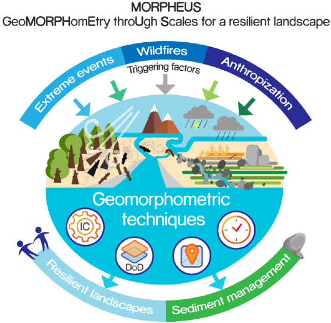
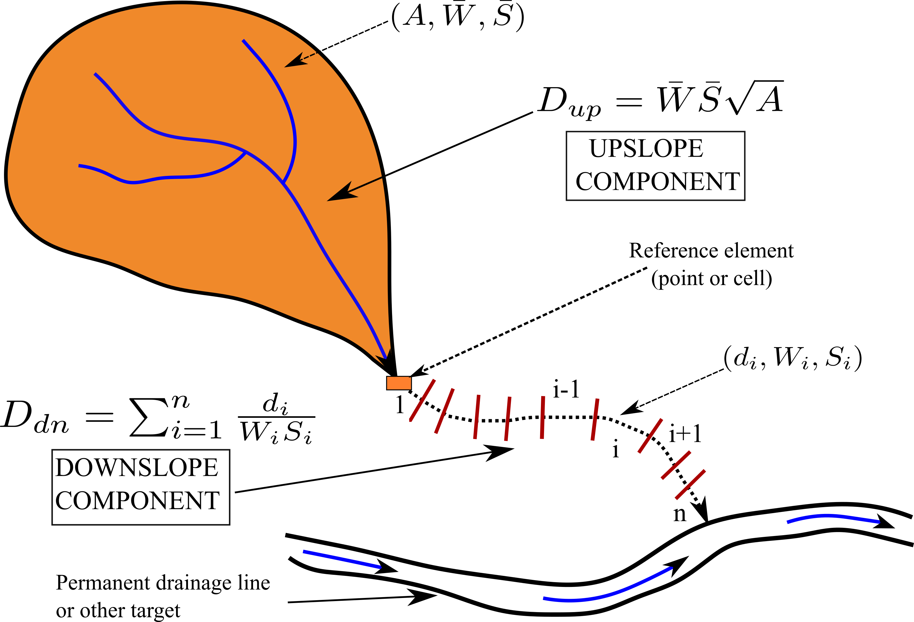

# SedInConnect 3.0

**Sediment Connectivity Index (IC) Calculation Tool**  
*Developed by CNR-IRPI Padova (Italy)*



## Overview

SedInConnect 3.0 is a professional geomorphometric tool designed to quantify sediment connectivity in catchments. Based on the methodology by **Cavalli et al. (2013)**, it calculates the Index of Connectivity (IC) to assess the potential for sediment transfer from source areas to specified targets.

<p align="center">
  
  <br>
  <i>Figure: Conceptual components of the Sediment Connectivity Index (IC)</i>
</p>

### Key Features
- **Professional Modular Architecture:** Clean, maintainable Python structure.
- **High Performance:** Optimized 2D convolution for fast surface roughness computation.
- **Large File Support:** Efficiently processes high-resolution DTMs.
- **Dual Mode:** Full modern GUI for interactive use and a powerful CLI for automation.
- **Advanced Hydrology:** Professional handling of sinks and target-specific catchments.

---

## How to Use

### 1. GUI Mode (Interactive)
The recommended way for most users. Run the main script to launch the interface:
```bash
python main.py
```
- **Sidebar:** Access project info and documentation.
- **Central Pane:** Configure your DTM, Weighting factors, Targets, and Sinks.
- **Right Pane:** Monitor real-time processing logs.

### 2. CLI Mode (Automation)
For batch processing or remote servers. The tool detects command-line arguments automatically.

**Using a JSON config file:**
```bash
python main.py --params "my_config.json"
```

**Using direct arguments:**
```bash
python main.py --dtm "path/to/dtm.tif" --output "path/to/result.tif" --auto-weight --window-size 5
```

---

## Installation & Requirements

### Standalone Executable
You can download the pre-compiled `SedInConnect_3_0.exe` from the [Releases](https://github.com/HydrogeomorphologyTools/SedInConnect_3.0/releases) section. No Python installation required.

### From Source
1. **Prerequisites:**
   - [TauDEM 5.3.7](https://hydrology.usu.edu/taudem/taudem5/index.html) and Microsoft MPI.
2. **Setup:**
   ```bash
   pip install -r requirements.txt
   python main.py
   ```

## References
- **Cavalli, M., et al. (2013).** Geomorphometric assessment of spatial sediment connectivity in small Alpine catchments. *Geomorphology, 188*, 31-41.
- **Crema, S., & Cavalli, M. (2018).** SedInConnect: a stand-alone, free and open source tool for sediment connectivity assessment. *Computers & Geosciences, 111*, 39-45.

---
**Authors:** Stefano Crema & Marco Cavalli  
**Project:** MORPHEUS  
**Institution:** CNR-IRPI, Padova, Italy
