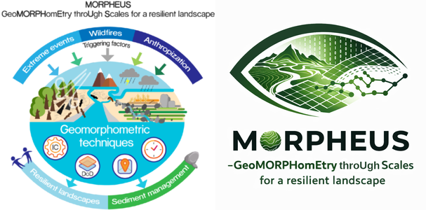
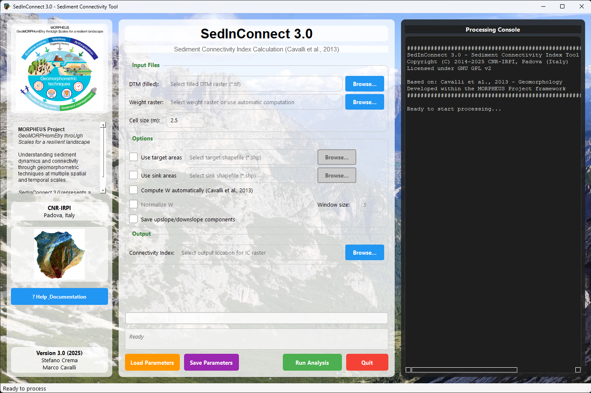

# SedInConnect 3.0

**Sediment Connectivity Index (IC) Calculation Tool**  
*Developed by CNR-IRPI Padova (Italy)*



## Overview

SedInConnect 3.0 is a professional geomorphometric tool designed to quantify sediment connectivity in catchments. Based on the methodology by **Cavalli et al. (2013)**, it calculates the Index of Connectivity (IC) to assess the potential for sediment transfer from source areas to specified targets.

<p align="center">
  
  <br>
  <i>Figure: SedInConnect 3.0 Graphical User Interface</i>
</p>

### Key Features
- **Professional Modular Architecture:** Clean, maintainable Python structure.
- **High Performance:** Optimized 2D convolution for fast surface roughness computation.
- **Large File Support:** Efficiently processes high-resolution DTMs.
- **Dual Mode:** Full modern GUI for interactive use and a powerful CLI for automation.
- **Advanced Hydrology:** Professional handling of sinks and target-specific catchments.

<p align="center">
  
  <br>
  <i>Figure: Conceptual components of the Sediment Connectivity Index (IC)</i>
</p>

---

## How to Use

### 1. GUI Mode (Interactive)
The recommended way for most users. Run the main script to launch the interface:
```bash
python main.py
```
- **Input Selection:** Easily browse for your DTM (Digital Terrain Model), Weighting factors, Targets (e.g., rivers, lakes), and Sinks (e.g., pits, dams).
- **Interactive Configuration:** Set moving window sizes for roughness calculation and choose between Cavalli (2013) weight or custom weight rasters.
- **Real-time Monitoring:** Watch the progress and detailed logs in the dedicated right-hand pane.
- **Session Management:** Save and Load your processing parameters as JSON files for reproducibility.

### 2. CLI Mode (Automation)
For batch processing, remote servers, or integration into GIS workflows. The tool automatically switches to CLI mode when arguments are provided.

**Basic command example:**
```bash
python main.py --dtm "path/to/dtm.tif" --output "path/to/result.tif" --auto-weight --window-size 5
```

**Advanced usage with all parameters:**
```bash
python main.py --dtm "dtm.tif" --output "ic.tif" --weight "slope.tif" --target "rivers.shp" --sink "pits.shp" --normalize --save-components
```

**Using a JSON config file (exported from GUI):**
```bash
python main.py --params "my_config.json"
```

**Available CLI Arguments:**
- `--dtm`: Path to the input DTM raster.
- `--output`: Path where the IC raster will be saved.
- `--weight`: (Optional) Path to a custom weighting factor raster.
- `--target`: (Optional) Path to a shapefile defining the target(s).
- `--sink`: (Optional) Path to a shapefile defining sinks.
- `--auto-weight`: Flag to automatically compute the Cavalli (2013) weight factor.
- `--normalize`: Flag to normalize the weight factor (0-1).
- `--window-size`: Size of the moving window (default: 5) for roughness calculation.
- `--save-components`: Save the intermediate D_up and D_down rasters.

---

## Installation & Requirements

### Standalone Executable
You can download the pre-compiled `SedInConnect_3_0.exe` from the [Releases](https://github.com/HydrogeomorphologyTools/SedInConnect_3.0/releases) section. No Python installation required.

### From Source
1. **Prerequisites:**
   - [TauDEM 5.3.7](https://hydrology.usu.edu/taudem/taudem5/index.html) and Microsoft MPI.
2. **Setup:**
   ```bash
   pip install -r requirements.txt
   python main.py
   ```

## 🇪🇺 Funding & Acknowledgements
This software has been developed as part of the research activities within the project:  
**PRIN 2022: PROGETTI DI RICERCA DI RILEVANTE INTERESSE NAZIONALE – Bando 2022**

- **Project Title:** MORPHEUS - GeoMORPHomEtry throUgh Scales for a resilient landscape
- **Protocol:** 2022JEFZRM
- **Financed by:** European Union - NextGenerationEU, Ministero dell'Università e della Ricerca (MUR), and Italia Domani (PNRR)

We acknowledge the financial support provided by the Italian Ministry of University and Research and the European Union under the NextGenerationEU framework and the Italia Domani (Piano Nazionale di Ripresa e Resilienza) initiative.

**Official Reference:**
> NATIONAL RECOVERY AND RESILIENCE PLAN (NRRP) – MISSION 4
> COMPONENT 2 INVESTMENT 1.1 – “Fund for the National Research Program and for Projects of National Interest (NRP)”

---

## References
- **Cavalli, M., et al. (2013).** Geomorphometric assessment of spatial sediment connectivity in small Alpine catchments. *Geomorphology, 188*, 31-41.
- **Crema, S., & Cavalli, M. (2018).** SedInConnect: a stand-alone, free and open source tool for sediment connectivity assessment. *Computers & Geosciences, 111*, 39-45.

---
**Authors:** Stefano Crema & Marco Cavalli  
**Institution:** CNR-IRPI, Padova, Italy
